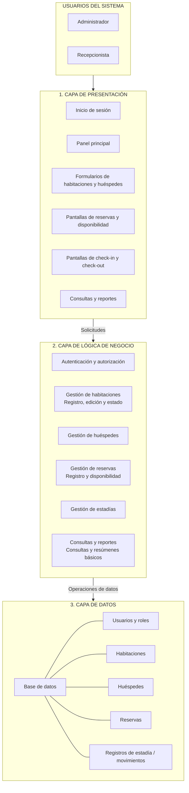
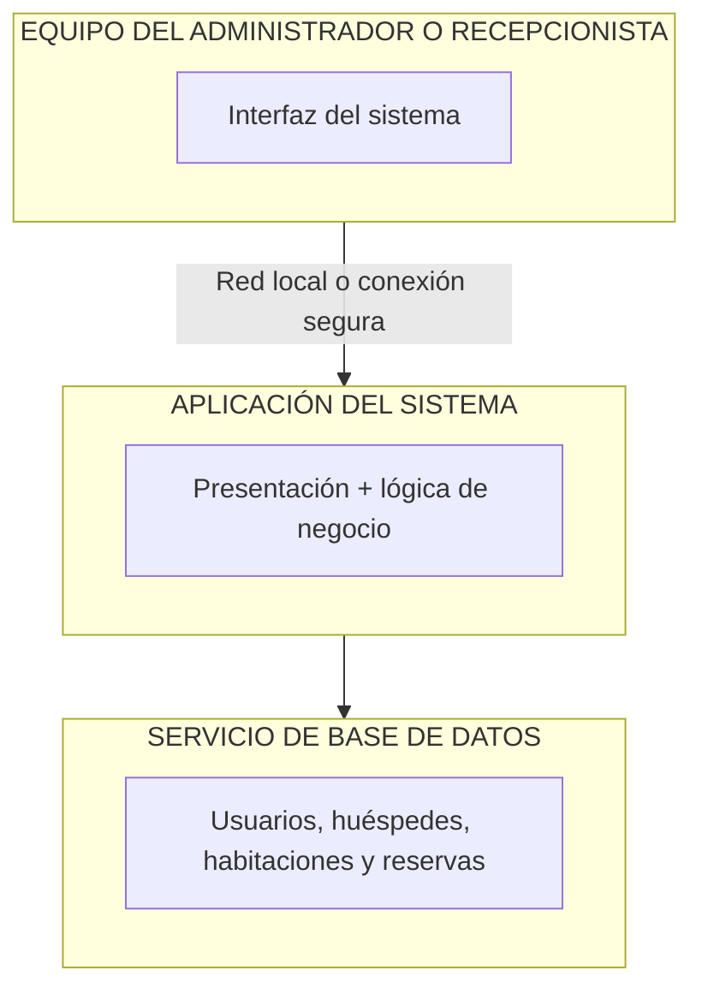

```mermaid
flowchart TD
    subgraph USUARIOS["USUARIOS DEL SISTEMA"]
        direction LR
        ADM["Administrador"]
        REC["Recepcionista"]
    end

    subgraph PRES["1. CAPA DE PRESENTACIÓN"]
        direction LR
        P1["Inicio de sesión"]
        P2["Panel principal"]
        P3["Formularios de habitaciones y huéspedes"]
        P4["Pantallas de reservas y disponibilidad"]
        P5["Pantallas de check-in y check-out"]
        P6["Consultas y reportes"]
    end

    subgraph NEG["2. CAPA DE LÓGICA DE NEGOCIO"]
        direction LR
        N1["Autenticación y autorización"]
        N2["Gestión de habitaciones<br/>Registro, edición y estado"]
        N3["Gestión de huéspedes"]
        N4["Gestión de reservas<br/>Registro y disponibilidad"]
        N5["Gestión de estadías"]
        N6["Consultas y reportes<br/>Consultas y resúmenes básicos"]
    end

    subgraph DAT["3. CAPA DE DATOS"]
        direction LR
        BD["Base de datos"]
        D1["Usuarios y roles"]
        D2["Habitaciones"]
        D3["Huéspedes"]
        D4["Reservas"]
        D5["Registros de estadía / movimientos"]
        BD --- D1 & D2 & D3 & D4 & D5
    end

    USUARIOS --> PRES
    PRES -->|Solicitudes| NEG
    NEG -->|Operaciones de datos| DAT
```

```mermaid
flowchart TD
    subgraph CLI["EQUIPO DEL ADMINISTRADOR O RECEPCIONISTA"]
        UI["Interfaz del sistema"]
    end

    subgraph APP["APLICACIÓN DEL SISTEMA"]
        AP["Presentación + lógica de negocio"]
    end

    subgraph DB["SERVICIO DE BASE DE DATOS"]
        BD["Usuarios, huéspedes, habitaciones y reservas"]
    end

    CLI -->|Red local o conexión segura| APP
    APP --> DB
```
